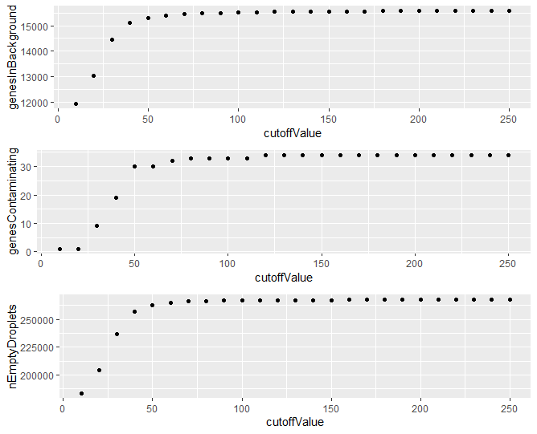
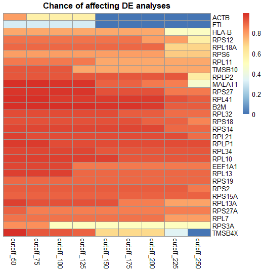
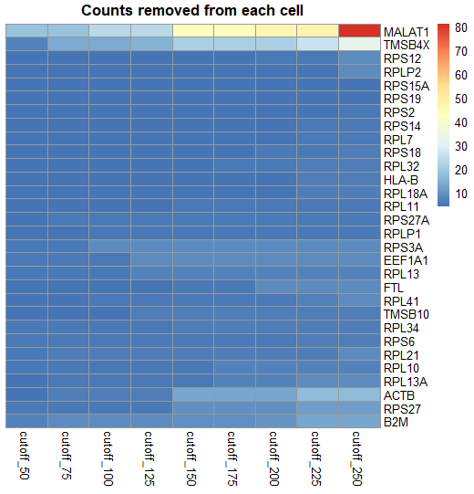

# FastCAR

FastCAR is an R package to remove ambient RNA from cells in droplet based single cell RNA sequencing data.


### Installation

FastCAR can be installed from git with the following command.

```
devtools::install_git("https://github.com/Nawijn-Group-Bioinformatics/FastCAR")
```

Running FastCAR is quite simple.
First load the library and dependencies.

```
library(Matrix)
library(Seurat)
library(qlcMatrix)
library(pheatmap)
library(ggplot2)
library(gridExtra)
library(stringr)
```

We will use public 10X PBMC data as an examples

```
tmpDir = tempdir(check = TRUE)
download.file("https://cf.10xgenomics.com/samples/cell-exp/2.1.0/pbmc4k/pbmc4k_raw_gene_bc_matrices.tar.gz", 
              destfile = file.path(tmpDir, "tod.tar.gz"))
download.file("https://cf.10xgenomics.com/samples/cell-exp/2.1.0/pbmc4k/pbmc4k_filtered_gene_bc_matrices.tar.gz", 
              destfile = file.path(tmpDir, "toc.tar.gz"))
untar(file.path(tmpDir, "tod.tar.gz"), exdir = tmpDir)
untar(file.path(tmpDir, "toc.tar.gz"), exdir = tmpDir)


cellMatrixLocation = paste0(tmpDir,"/filtered_gene_bc_matrices/GRCh38")
fullMatrixLocation = paste0(tmpDir,"/raw_gene_bc_matrices/GRCh38")


```

Load both the cell matrix and the full matrix using Seurat 

```
cellMatrix     = Read10X(cellExpressionFolder)
fullMatrix     = Read10X(fullMatrixFolder)
```
The following functions give an idea of the effect that different settings have on the ambient RNA profile. 
These are optional as they do take a few minutes and the default settings work fine
Plotting the number of empty droplets, the number of genes identified in the ambient RNA, and the number of genes that will be corrected for at different UMI cutoffs,

```
ambProfile = describe.ambient.RNA.sequence(fullCellMatrix = fullMatrix, 
                                           start = 10, 
                                           stop = 500, 
                                           by = 10, 
                                           contaminationChanceCutoff = 0.05)
                                           
plot.ambient.profile(ambProfile)
``` 



The actual effect on the chances of genes affecting your DE analyses can be determined and visualized with the following function

``` 
  
  correctionEffectProfile = describe.correction.effect(fullMatrix, cellMatrix, 50, 250, 25, 0.05)
  
  plot.correction.effect.chance(correctionEffectProfile)
  
```




How many reads will be removed of these genes can be visualized from the same profile
```

  plot.correction.effect.removal(correctionEffectProfile)

``` 




Set the empty droplet cutoff and the contamination chance cutoff

The empty droplet cutoff is the number of UMIs a droplet can contain at the most to be considered empty.
100 works fine but we tested this method in only one tissue. For other tissues these settings may need to be changed.
Increasing this number also increases the highest possible value of expression of a given gene.
As the correction will remove this value from every cell it is adviced not to set this too high and thereby overcorrect the expression in lowly expressing cells.

The contamination chance cutoff is the allowed probability of a gene contaminating a cell. 
As we developed FastCAR specifically for differential expression analyses between groups we suggest setting this such that not enough cells could be contaminated to affect this.
In a cluster of a thousand cells divided into two groups there would be 2-3 cells per group with ambient RNA contamination of any given gene.
Such low cell numbers are disregarded for differential expression analyses.

There is an experimental function that gives a recommendation based on the ambient profiling results.
This selects the first instance of the maximum number of genes being corrected for.
I have no idea yet if this is actually a good idea.

```
emptyDropletCutoff = recommend.empty.cutoff(ambProfile)
```


```
emptyDropletCutoff        = 150 
contaminationChanceCutoff = 0.005
```

Determine the ambient RNA profile and remove the ambient RNA from each cell
```
ambientProfile = determine.background.to.remove(fullMatrix, emptyDropletCutoff, contaminationChanceCutoff)
cellMatrix     = remove.background(cellMatrix, ambientProfile)
```

This corrected matrix can be used to to make a Seurat object

```
seuratObject = CreateSeuratObject(cellMatrix) 
```


## Authors

* **Marijn Berg** - m.berg@umcg.nl

## License

This project is licensed under the GPL-3 License - see the [LICENSE.md](LICENSE.md) file for details

## Changelog

### v0.1
First fully working version of the R package

### v0.2
Fixed function to write the corrected matrix to file.
Added readout of which genes will be corrected for and how many reads will be removed per cell
Added some input checks to functions

### v0.2
Fixed a bug that caused FastCAR to be incompatible with biobase libraries
Added better profiling to determine the effect of different settings on the corrections
Swapped base R plots for ggplot2 plots


